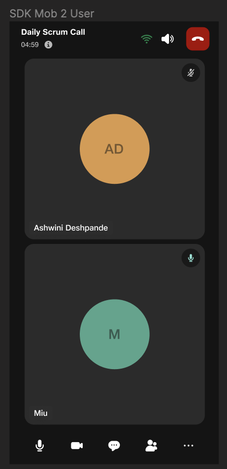

# JioMeet Template UI Quickstart

**Welcome to Jiomeet Template UI**, a SDK that streamlines the integration of Jiomeet's powerful audio and video functionalities, along with an array of features such as the Participant panel, virtual background, and screen sharing/whiteboard sharing, into your Android application with minimal coding effort. With just a few simple steps, you can enable high-quality real-time communication, allowing users to effortlessly connect, collaborate, and communicate.

## Table of Contents

1. [Introduction](#introduction)
2. [Features](#features)
3. [Prerequisites](#prerequisites)
   - [Hilt](#hilt)
   - [Jetpack Compose](#jetpack-compose)
4. [Setup](#setup)
   - [Register on JioMeet Platform](#register-on-jiomeet-platform)
   - [Get Your Application Keys](#get-your-application-keys)
   - [Get Your JioMeet Meeting ID and PIN](#get-your-jiomeet-meeting-id-and-pin)
5. [Configure JioMeet Template UI Inside Your App](#configure-jiomeet-template-ui-inside-your-app)
   - [Add permissions for network and device access](#add-permissions-for-network-and-device-access)
   - [Initiliazing Hilt in Application Class](#initialize-hilt-in-application-class)
   - [Start Your App](#start-your-app)
6. [Sample App](#sample-app)
7. [Troubleshooting](#troubleshooting)

## Introduction

In this documentation, we'll guide you through the process of installation, enabling you to enhance your Android app with Jiomeet's real-time communication capabilities swiftly and efficiently.Let's get started on your journey to creating seamless communication experiences with Jiomeet Template UI!



---

## Features

In Jiomeet Template UI, you'll find a range of powerful features designed to enhance your Android application's communication and collaboration capabilities. These features include:

1. **Voice and Video Calling**:Enjoy high-quality, real-time audio and video calls with your contacts.

2. **Participant Panel**: Manage and monitor participants in real-time meetings or video calls for a seamless user experience.

3. **Virtual Background**: Customize the background of your video calls, adding a touch of professionalism or fun to your communication.

4. **Screen Sharing and Whiteboard Sharing**: Empower collaboration by sharing your screen or using a virtual whiteboard during meetings or video conferences.

5. **Group Conversation**: Easily engage in text-based conversations with multiple participants in one chat group.
6. **Inspect Call Health**: Monitor the quality and performance of your audio and video calls to ensure a seamless communication experience.
   </br></br>

## Prerequisites

Before you begin, ensure you have met the following requirements:

#### Hilt:

To set up Hilt in your Android project, follow these steps:

1. First, add the hilt-android-gradle-plugin plugin to your project’s root build.gradle file:

   ```gradle
   plugins {
   id("com.google.dagger.hilt.android") version "2.44" apply false
   }
   ```

2. Add the Hilt dependencies to the app-level build.gradle file

   ````gradle
   plugins {
     kotlin("kapt")
     id("com.google.dagger.hilt.android")
   }

   android {
       ...
       compileOptions {
           sourceCompatibility = JavaVersion.VERSION_11
           targetCompatibility = JavaVersion.VERSION_11
       }
   }

   dependencies {
           implementation "androidx.hilt:hilt-navigation-compose:1.0.0"
           implementation "com.google.dagger:hilt-android:2.44"
           kapt "com.google.dagger:hilt-android-compiler:2.44"
   } ```
   ````

#### Jetpack Compose:

JioMeet Template UI relies on Jetpack Compose for its user interface components.
Ensure that your Android project is configured to use Jetpack Compose. You can add the necessary configurations to your project's build.gradle file:

```gradle
  // Enable Jetpack Compose
  buildFeatures {
      compose true
  }

  // Set the Kotlin compiler extension version for Compose
  composeOptions {
      kotlinCompilerExtensionVersion = "1.3.2"
  }
```

---

## Setup

##### Register on JioMeet Platform:

You need to first register on Jiomeet platform.[Click here to sign up](https://platform.jiomeet.com/login/signUp)

##### Get your application keys:

Create a new app. Please follow the steps provided in the [Documentation guide](https://dev.jiomeet.com/docs/quick-start/introduction) to create apps before you proceed.

###### Get you Jiomeet meeting id and pin

Use the [create meeting api](https://dev.jiomeet.com/docs/JioMeet%20Platform%20Server%20APIs/create-a-dynamic-meeting) to get your room id and password

## Configure JioMeet Template UI inside your app

i. **Step 1** : Generate a Personal Access Token for GitHub 
* Settings -> Developer Settings -> Personal Access Tokens -> Generate new token
* Make sure you select the following scopes (“ read:packages”) and Generate a token
* After Generating make sure to copy your new personal access token. You cannot see it again! The only option is to generate a new key.

ii.  Update build.gradle inside the application module

```kotlin
    repositories {
        maven {
            credentials {
                   <!--github user name-->
                    username = ""
                 <!--github user token-->
                    password = ""
            }
            url = uri("https://maven.pkg.github.com/JioMeet/JioMeetCoreTemplateSDK_ANDROID")
        }
        google()
        mavenCentral()
    }
```

iii. In Gradle Scripts/build.gradle (Module: <projectname>) add the Template UI dependency. The dependencies section should look like the following:

```gradle
dependencies {
    ...
    implementation "com.jiomeet.platform:jiomeetcoretemplatesdk:<version>"
    ...
}
```

Find the [Latest version](https://github.com/JioMeet/JioMeetCoreTemplateSDK_ANDROID/releases) of the UI Kit and replace <version> with the one you want to use. For example: 2.1.8.

### Add permissions for network and device access.

In /app/Manifests/AndroidManifest.xml, add the following permissions after </application>:

```gradle
<uses-permission android:name="android.permission.READ_PHONE_STATE"/>
<uses-permission android:name="android.permission.INTERNET" />
<uses-permission android:name="android.permission.RECORD_AUDIO" />
<uses-permission android:name="android.permission.CAMERA" />
<uses-permission android:name="android.permission.MODIFY_AUDIO_SETTINGS" />
<uses-permission android:name="android.permission.ACCESS_WIFI_STATE" />
<uses-permission android:name="android.permission.ACCESS_NETWORK_STATE" />

<!-- The SDK requires Bluetooth permissions in case users are using Bluetooth devices. -->
<uses-permission android:name="android.permission.BLUETOOTH" />
<!-- For Android 12 and above devices, the following permission is also required. -->
<uses-permission android:name="android.permission.BLUETOOTH_CONNECT" />
```

### Requesting run time permissions

it's crucial to request some permissions like **_CAMERA ,RECORD_AUDIO, READ_PHONE_STATE_** at runtime since these are critical device access permissins to ensure a seamless and secure user experience. Follow these steps

1. Check Permissions

```kotlin
if (checkPermissions()) {
    // Proceed with using the features.
} else {
    // Request critical permissions at runtime.
}
```

2. Request Runtime Permissions:

```kotlin
private void requestCriticalPermissions() {
    ActivityCompat.requestPermissions(this,
            new String[]{
                Manifest.permission.READ_PHONE_STATE,
                Manifest.permission.CAMERA,
                Manifest.permission.RECORD_AUDIO
            },
            PERMISSION_REQUEST_CODE);

}
```

3. Handle Permission Results

```kotlin
@Override
public void onRequestPermissionsResult(int requestCode, @NonNull String[] permissions, @NonNull int[] grantResults) {
    if (requestCode == PERMISSION_REQUEST_CODE) {
        if (areAllPermissionsGranted(grantResults)) {
            // Proceed with using the features that require critical permissions.
        } else {
            // Handle denied permissions, especially for camera and phone state, which are essential.
        }
    }
}
```

### Initiliazing Hilt in Application Class

1. Create a Custom Application Class: If your users don't already have a custom Application class in their Android project, they should create one. This class will be used to initialize Hilt.

```kotlin
import android.app.Application;
import dagger.hilt.android.HiltAndroidApp;

@HiltAndroidApp
class MyApplication : Application {
    // ...
}
```

2. Modify AndroidManifest.xml: In the AndroidManifest.xml file of their app, users should specify the custom Application class they created as the application name. This tells Android to use their custom Application class when the app starts.

```xml
<application
    android:name=".MyApplication" <!-- Specify the name of your custom Application class -->
    android:icon="@mipmap/ic_launcher"
    android:label="@string/app_name"
    android:theme="@style/AppTheme">
    <!-- ... -->
</application>
```

### Start your App

In /app/java/com.example.<projectname>/MainActivity, add @AndroidEntryPoint to enable Hilt injection. Here's an example:

```kotlin
   import dagger.hilt.android.AndroidEntryPoint;

   @AndroidEntryPoint
   class MainActivity : AppCompatActivity() {
   // ...
}
```

update onCreate to run LaunchCore() when the app starts. The updated code should like the provided code sample:

```kotlin
   private val jioMeetConnectionListener = object : JioMeetConnectionListener {

       override fun onShareInviteClicked(meetingId: String, meetingPin: String, name: String) {
               Log.e("shareInviteClicked", "shareInviteClicked")
       }

       override fun closeWatchParty() {
           finish()
       }

       override fun onAnalyticsEvent(analyticsEvent: AnalyticsEvent) {
           Log.e("shareInviteClicked", analyticsEvent.pageName)
       }

   }

override fun onCreate(savedInstanceState: Bundle?) {
       super.onCreate(savedInstanceState)
       setContent {
           val joinCallIntent = Intent()
           joinCallIntent.putExtra(
               JioMeetSdkManager.MEETING_ID,
               "" //Add meeting id here
           )
           joinCallIntent.putExtra(
               JioMeetSdkManager.MEETING_PIN,
               "" // Add meeting password here
           )
           joinCallIntent.putExtra(JioMeetSdkManager.GUEST_NAME, "guestName")
           LaunchCore(
               intent = joinCallIntent,
               jioMeetConnectionListener = jioMeetConnectionListener
           )
       }
   }
```

The JioMeetConnectionListener interface allows you to receive important events and callbacks related to a Jio-Meet session. You can implement this interface to handle various events that occur during a meeting, such as participants joining or leaving, errors, analytics events, and more. Below are the available callbacks, use can use these callbacks to implement custom behaviour

- **_onShareInviteClicked_**(meetingId: String, meetingPin: String, name: String)
  ```Kotlin
  override fun onShareInviteClicked(meetingId: String, meetingPin: String, name: String) {
      // Implement custom behavior for sharing meeting details
  }
  ```
- **_closeWatchParty_**()
  ```Kotlin
  override fun closeWatchParty() {
      finish() // Close the activity when watch party is closed
  }
  ```
- **_onAnalyticsEvent_**(analyticsEvent: AnalyticsEvent)
  ```Kotlin
  override fun onAnalyticsEvent(analyticsEvent: AnalyticsEvent) {
      // Log or track analytics event information
  }
  ```
- **_Other Callbacks_**
  Depending on your use case, there are additional callbacks available in the JioMeetConnectionListener interface for handling various aspects of the meeting, such as **_microphone and camera status_**, **_remote participant actions_**, and more.
  Please implement the necessary callbacks in your JioMeetConnectionListener implementation to customize the behavior of your JioMeet integration as per your application's requirements.

## Sample app

Visit our [Jiomeet Template UI Sample app](https://github.com/JioMeet/JioMeetCoreTemplateSDK_ANDROID) repo to run the ample app.

---

## Troubleshooting

- Facing any issues while integrating or installing the JioMeet Template UI Kit please connect with us via real time support present in jiomeet.support@jio.com or https://jiomeetpro.jio.com/contact-us

---
